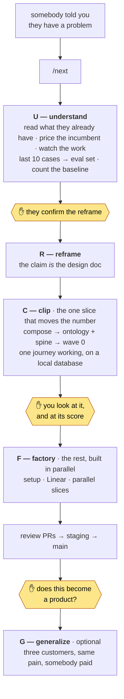
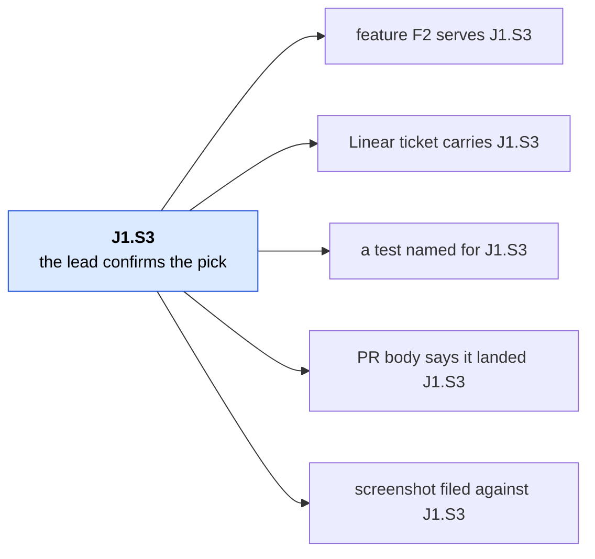
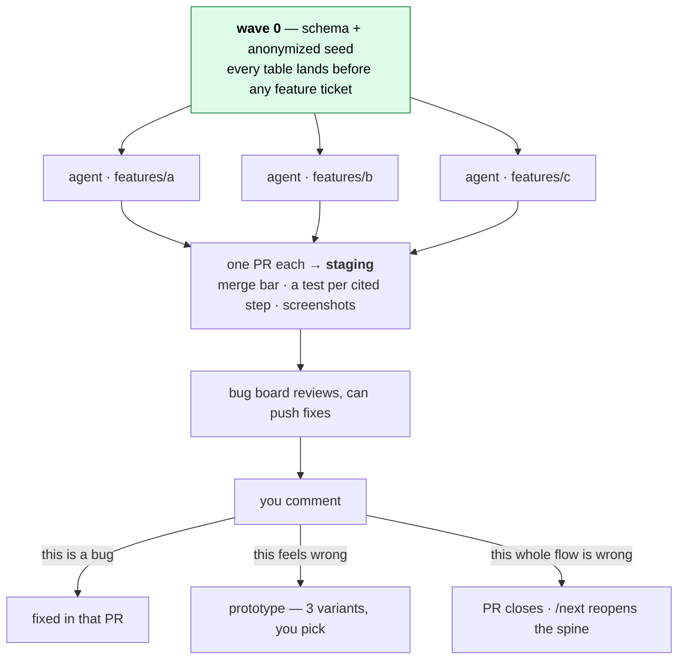

# ViperNxt

**It won't let you build for a customer who doesn't exist.**

Somebody told you they have a problem. A person, who said it, whose name you can
write down — that is the only way in, and `check-drift` enforces it. From there:
read what they already have, find the smallest thing that moves their number,
build it, show them the score. The rest in parallel, only after they accept it.

This is the procedure for that first week, written so an agent runs most of it,
plus the stack it builds on.

**What it is best at is stopping you.** Before it designs anything it prices
what they already pay for, because the most expensive week is the one spent
rebuilding a feature your customer already buys. *"They should upgrade instead"*
is a result this thing can produce, and so is *"don't build this."*

Requires [Bun](https://bun.sh) `1.4.x`.

```bash
bun install
```

Then type **`/next`** and name the person and what they use today. That is the
whole instruction — `/next` works out where you are, every time.

<details>
<summary><b>The year this was built to prevent</b> — a real one</summary>

Software for driving schools. A year of work, ~1,400 commits.

Two schools asked for it and used it. Both were unusual: bigger than average,
run by people who liked technology. Everything you would want from a design
partner — and that is the problem. **They were the tail of the distribution, and
the product was built for them.**

Sold to the wider market, almost nobody cared. Instructor labour is cheap, the
margins are thin, the owner is the operator, and there is no budget line for
software. The pain was real. It just was not worth money to the people who had it.

Here is the part that stings: **no vendor sold anything to driving schools**, and
that read as open ground. It is the opposite. Others had tried and left, because
nobody paid. One hour of asking *"why did they leave?"* would have said so.

Nothing in the interviews would have surfaced it. Both customers were happy.

Two gates now exist because of this — U1 asks what the pain costs per month in
real money and why an empty category is empty, and [G](#one-customer-first-a-product-only-if-it-earns-it)
refuses to call one customer a market.

</details>

---

## The loop



| After | You have |
|---|---|
| an hour | everything they already have, read and cited; the incumbent named and priced; a short list of what only they can tell you |
| a day or two | one paragraph you confirmed: the outcome number, whose pain it is, why the obvious build is wrong |
| a day after that | a named clone, a composed stack, the domain model in their vocabulary, an ID'd journey spine |
| end of the week | one journey working on real seeded data **on your laptop**, scored against their last ten cases |
| after you accept it | infrastructure, tickets, parallel slices |
| later, if you want | the question of whether this becomes a product — asked with one customer live behind you, not guessed up front |

Nothing before the last row needs a GitHub repo, a Neon account, a Vercel
project, or a credit card. Procedure:
[docs/playbook/fde-loop.md](docs/playbook/fde-loop.md).

## What they use today is the first real signal

It is the first thing `/next` asks, and it runs opposite to intuition:

| What they use today | What it tells you |
|---|---|
| Nothing — it lives in their head | Nobody has ever paid to fix this. **Highest risk** |
| Paper, WhatsApp, a register | Labour is the incumbent. You have to beat the cost of a cheap person, not the annoyance |
| One piece of software | **They pay for software.** Budget proven, buyer identified. Lowest risk |
| Several tools, bad seams | Budget proven and generous. The pain is the seams — often the best work there is |

Empty ground reads as opportunity and usually means nobody paid. That is the
whole of the driving-school story above, in one row.

## Where it stops for you

The rule the agent follows is *never stop for something it could have found out
itself*. Four stops are left, and every one is a hard block.

| # | Stop | Kind | Why it cannot be skipped |
|---|---|---|---|
| 1 | **Everything they already have** | gather | `salvage` will not start on a half-empty folder. "They should upgrade instead of building" is a valid outcome |
| 2 | **The homework** | gather | No research tells you the clerk keeps a code sheet taped to the monitor. Until you go and watch, the product is guesses |
| 3 | **Approve the reframe** | decide | Until you say yes, writes to `apps/*/src/app` and `src/features` are **denied by a hook** |
| 4 | **Look at the first slice** | decide | One journey end-to-end before forty tickets inherit a wrong domain model |

Gather stops need real-world material — drop it per
[docs/inbox.md](docs/inbox.md). While you are out, the agent keeps researching
whatever does not depend on you.

**It will not** start from an idea nobody has asked for, decide what the product
is, let you pick a stack per customer, or ship auth on day one.

Bring an idea with no customer and it will research who already sells it, then
stop and ask you to go find the person with the problem. That is not a failure
mode — it is the feature.

**You need a person, not an idea.** Somebody who told you they have this problem,
whose name you can write down. No name and nothing past the category scan opens —
`check-drift` enforces it. That is the point: the fastest way to waste a year is
to build something well for a customer who does not exist.

## One customer first. A product only if it earns it.

Every engagement is built for one customer. **G — generalize** is the question
you are allowed to ask once that customer is actually using the thing: does this
become a product?

There is no flag for it, and you do not declare it up front — that would be a
guess about the future, and the loop refuses those everywhere else. You enter G
when you want to, with one customer already using it.

It exists to prevent one specific year-long mistake: the thing works for one
customer, you generalize from a sample of one, and a year later two people use
it. The customer was not wrong. **The sample was.**

| | What it asks |
|---|---|
| G1 | Is this customer typical? A design partner excited about technology is the tail of the distribution, not the middle |
| G2 | The same pain, named independently, by three customers — **at least one of them boring** |
| G3 | Price evidence, not enthusiasm: a deposit, an LOI, or a cheaper thing they already cancelled. "Nice to have" is a no |
| G4 | What in the code was theirs, and what generalizes? |

If it fails, record why and stop. **One tool for one customer is a finished
product, not a failed SaaS.** Your dad's books, one shop's counter, one clinic's
front desk — those are done when they work, and nobody has to pretend otherwise.

## The journey spine

The centre of everything. After the design doc, journeys become YAML where every
step has a permanent ID. Meaning changes → new ID. Never recycled.



An agent cannot quietly build something nobody asked for, because there is
nowhere to hang it. A slice that cannot name its step ID is the signal to stop
and ask you. `bun run check-journeys` enforces the IDs are real; it does not
require every served step to be cited — a first slice correctly leaves later
beats uncited. `--complete` is what acceptance runs.

## How the factory builds



Wave 0 first is what makes parallel building safe — migrations are done, so no
two agents fight over the database. Features live in `src/features/<slug>/` and
cannot import each other, so agents in different folders physically cannot
collide. Anything touching routes, `shared/`, packages or schema runs alone.

Journey-level feedback goes back to the spine, never absorbed quietly into a
diff — otherwise code and plan drift and everything after inherits it.

## Tests say one thing, the score says another

Tests say the code does what the spine specified. `bun scripts/eval.ts` replays
the customer's **last ten real cases** and says whether the product would have
caught what actually went wrong:

```
  pass  PBC-14  IAM list was current-state, 4 users deprovisioned before 6/30
  skip  PBC-33  BCP test had never been performed
        A missing control, not a defective artifact. Out of scope by kind.

score: 4 of 10 real cases handled — 4 attempted, 6 out of this slice
```

A slice can be fully green and score 2 of 10. That is a finding for the
checkpoint, not a merge blocker — it is what you show them instead of "it works".
Cases live in `*.eval.ts` beside the code; one the slice does not cover is
`skip:` **with a reason**, because a skip that quietly disappears reads as a pass.

> **Playwright is not composed yet.** The recipe names it as the intended e2e
> layer but nothing scaffolds it. Evidence for the first slice is the merge bar,
> `bun test`, and screenshots from `next dev`.

## The opinions

- **Read before you invent.** `salvage` runs on every product — something is
  always being replaced. Mine it for **facts, never structure**: what a receipt
  must legally carry, not which pages the old app had.
- **One vocabulary.** If the customer says *pick ticket*, the code says
  `pick_ticket`. Otherwise five agents invent five translations of one word.
- **Features cannot import each other.** `bun run check-boundaries` enforces it;
  a failure means a piece of logic earned promotion to `shared/`.
- **The stack is a recipe.** Change [recipe.yaml](docs/kit/recipe.yaml) once;
  clones compose from it. npm, ESLint, Vitest, Prisma and NextAuth arguments are
  closed here.

| Layer | Default | Skip |
|---|---|---|
| Install / app | Bun · Next.js App Router → `apps/web` | npm, pnpm, yarn |
| Auth | Clerk | `--without auth` |
| Database | Drizzle + Neon (PGlite locally) | omit `--add db` |
| Jobs · Analytics · Email · Files | Workflows · PostHog · Resend · Vercel Blob | `--without jobs\|analytics\|email\|files` |
| UI · Lint · Test | shadcn in `packages/ui` · Biome · `bun test` | ESLint, Vitest, Jest |

## Skills

Skills live in [`.agents/skills/`](.agents/skills/); Claude Code and Cursor see
them through symlinks. **You type `/next`.** Everything else is called for you.

| You type | What it does |
|---|---|
| `/next` | The router. New idea, resuming after a week, answering a question, naming a feature — all of it |
| `/status` | Read-only glance: where things stand, what you owe |

## Commands

```bash
bun run dev
bun run check-types && bun run check-boundaries && bun run check-tokens && bun run check-journeys && bun test
bun scripts/eval.ts                       # score the slice against the last 10 real cases
bun scripts/compose.mjs --add web --add db
bun run db generate && bun run db seed    # seed depends on migrate
bun run db reset                          # local PGlite wedged? throw it away and reseed
```

**You do not need a database to start.** With `DATABASE_URL` unset, `packages/db`
runs on PGlite — Postgres compiled to WASM, no daemon and no account. It refuses
that fallback under `NODE_ENV=production`, so a deploy missing the variable fails
loudly. Clerk runs keyless in `next dev` the same way. PGlite is
single-connection: the dev server *or* a script, not both. An uncleanly killed
`next dev` can leave it unopenable (`RuntimeError: Aborted()`) — it is seed data,
so `bun run db reset`.

Point it at Neon when ready: `DATABASE_URL` (pooled) and `DATABASE_URL_UNPOOLED`
(direct, for `db push` / `db studio`). Lefthook runs Biome, boundaries and
affected typechecks on commit; import `env` from `@/env`, never `process.env`.

## Branches

`staging` is where everything lands — branch from it, open PRs into it. Merge
`staging` → `main` to release. Rebase before merging; five parallel agents make
your base stale fast. Hotfixes branch from `main` and back-merge the same day.
Both branches run [migrate.yml](.github/workflows/migrate.yml); additive
migrations only.

---

Live engagements belong on a **throwaway clone**. Do not commit a customer, their files,
or `docs/product/state.yaml` into this kit. Learnings that generalize come back
as playbook.

Internal map: [docs/map.md](docs/map.md) · Agent constraints:
[AGENTS.md](AGENTS.md) · Playbook source:
[saas-playbook](https://github.com/hivinaynair/saas-playbook)
