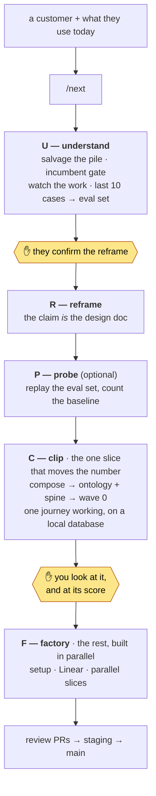
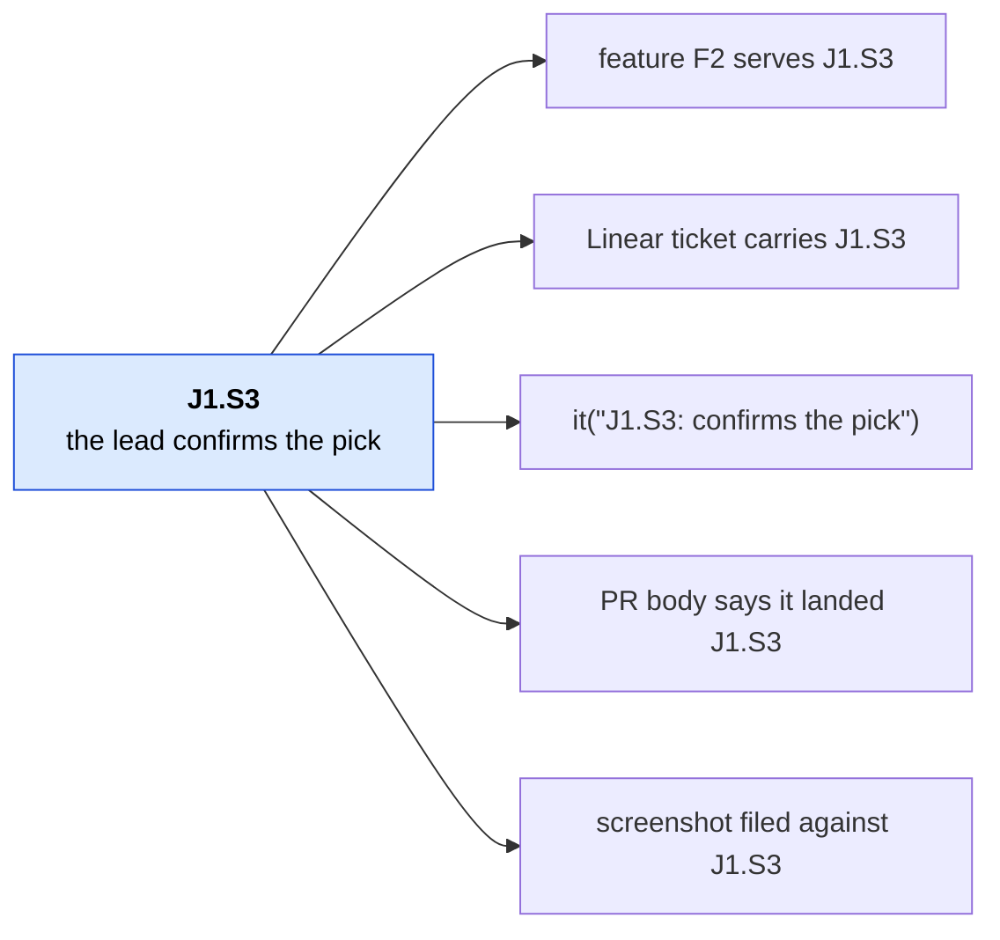
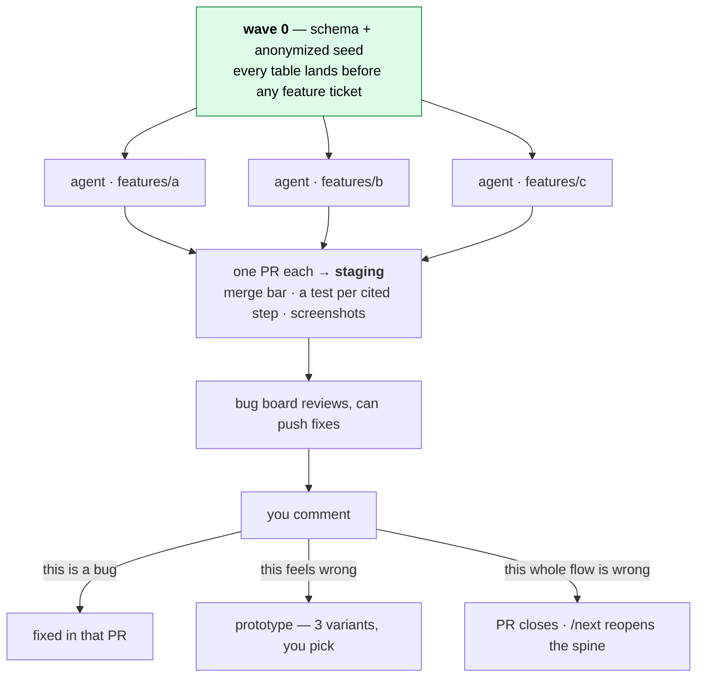

# ViperNxt

**Sit where the work happens. Leave with one slice that moves a real number —
then build the rest in parallel.**

You have a customer with a problem and you are about to build them software.
This repo is the procedure for that first week — written so an agent runs most
of it — plus the stack it builds on.

**What it is best at is stopping you building the wrong thing.** Before it
designs anything it reads whatever the job runs on today and prices the
incumbent, because the most expensive week is the one spent rebuilding a feature
your customer already pays for.

Requires [Bun](https://bun.sh) `1.4.x`.

```bash
bun install
```

Then type **`/next`** and name the customer — the actual place the work happens —
plus what they use today. That is the whole instruction; `/next` works out where
you are, every time.

<details>
<summary><b>A worked example</b> — one engagement, start to first screen</summary>

A test run of this kit against an invented but realistic customer: a compliance
manager at a fintech, drowning in a SOC 2 audit. The obvious build was a tracker
for the auditor's request list.

- **Phase 0 killed that idea.** Salvage priced the incumbent before designing
  anything: the customer already paid $27k/yr for Vanta, and Vanta ships that
  tracker. So do Drata and Secureframe.
- **What survived was smaller and real.** Of their last ten evidence requests,
  six came back from the auditor — four for the same reason: the file was right
  but described the wrong *period*. Nobody checked before sending.
- **The clip became a pre-flight check**, not a tracker. One screen that reads a
  file and says "this describes September; they asked for June, ending 06-30".
- **Scored, not asserted.** Replaying their ten real cases: 4 of 10 handled, 6
  explicitly out of the first slice with reasons. That number is what you show
  them — not "it works".

The point is the first bullet. Nothing in the interview would have surfaced it;
the customer asked for the tracker.

</details>

---

## The loop



| After | You have |
|---|---|
| an hour | their pile — everything they already have — read and cited, the incumbent named and priced, a short list of what only they can tell you |
| a day or two | one paragraph you confirmed: the outcome number, whose pain it is, why the obvious build is wrong |
| a day after that | a named clone, a composed stack, the domain model in their vocabulary, an ID'd journey spine |
| end of the week | one journey working on real seeded data **on your laptop**, scored against their last ten cases |
| after you accept it | infrastructure, tickets, parallel slices |

Nothing before the last row needs a GitHub repo, a Neon account, a Vercel
project, or a credit card. Procedure:
[docs/playbook/fde-loop.md](docs/playbook/fde-loop.md).

## Where it stops for you

The rule the agent follows is *never stop for something it could have found out
itself*. Four stops are left, and every one is a hard block.

| # | Stop | Kind | Why it cannot be skipped |
|---|---|---|---|
| 1 | **Your pile** | gather | `salvage` will not start on a half-empty folder. "Upgrade the incumbent instead of building" is a valid outcome |
| 2 | **The homework** | gather | No research tells you the clerk keeps a code sheet taped to the monitor. Until you look, the product is guesses |
| 3 | **Approve the reframe** | decide | Until you say yes, writes to `apps/*/src/app` and `src/features` are **denied by a hook** |
| 4 | **Look at the first slice** | decide | One journey end-to-end before forty tickets inherit a wrong domain model |

Gather stops need real-world material — drop it per
[docs/inbox.md](docs/inbox.md). While you are out, the agent keeps researching
whatever does not depend on you.

**It will not** turn an idea into a weekend MVP, decide what the product is, let
you pick a stack per customer, or ship auth on day one.

## The journey spine

The centre of everything. After the design doc, journeys become YAML where every
step has a permanent ID. Meaning changes → new ID. Never recycled.



An agent cannot quietly build something nobody asked for, because there is
nowhere to hang it. A slice that cannot name its step ID is the signal to stop
and ask you. `bun run check-journeys` enforces the IDs are real; it does not
require every served step to be cited — a first slice correctly leaves later
beats uncited. `--complete` is clip acceptance.

## How the factory builds



Wave 0 first is what makes parallel building safe — migrations are done, so no
two agents fight over the database. Features live in `src/features/<slug>/` and
cannot import each other, so agents in different folders physically cannot
collide. Anything touching routes, `shared/`, packages or schema runs alone.

Journey-level feedback goes back to the spine, never absorbed quietly into a
diff — otherwise code and plan drift and everything after inherits it.

## Tests say one thing, the score says another

Tests say the code does what the spine specified. `bun scripts/eval.ts` replays
the customer's **last ten real cases** and says whether the product would have
caught what actually went wrong:

```
  pass  PBC-14  IAM list was current-state, 4 users deprovisioned before 6/30
  skip  PBC-33  BCP test had never been performed
        A missing control, not a defective artifact. Out of scope by kind.

score: 4 of 10 real cases handled — 4 attempted, 6 out of this slice
```

A slice can be fully green and score 2 of 10. That is a finding for the
checkpoint, not a merge blocker — it is what you show them instead of "it works".
Cases live in `*.eval.ts` beside the code; one the slice does not cover is
`skip:` **with a reason**, because a skip that quietly disappears reads as a pass.

> **Playwright is not composed yet.** The recipe names it as the intended e2e
> layer but nothing scaffolds it. Evidence for the first slice is the merge bar,
> `bun test`, and screenshots from `next dev`.

## The opinions

- **Read before you invent.** `salvage` runs on every product — something is
  always being replaced. Mine it for **facts, never structure**: what a receipt
  must legally carry, not which pages the old app had.
- **One vocabulary.** If the site says *pick ticket*, the code says
  `pick_ticket`. Otherwise five agents invent five translations of one word.
- **Features cannot import each other.** `bun run check-boundaries` enforces it;
  a failure means a piece of logic earned promotion to `shared/`.
- **The stack is a recipe.** Change [recipe.yaml](docs/kit/recipe.yaml) once;
  clones compose from it. npm, ESLint, Vitest, Prisma and NextAuth arguments are
  closed here.

| Layer | Default | Skip |
|---|---|---|
| Install / app | Bun · Next.js App Router → `apps/web` | npm, pnpm, yarn |
| Auth | Clerk | `--without auth` |
| Database | Drizzle + Neon (PGlite locally) | omit `--add db` |
| Jobs · Analytics · Email · Files | Workflows · PostHog · Resend · Vercel Blob | `--without jobs\|analytics\|email\|files` |
| UI · Lint · Test | shadcn in `packages/ui` · Biome · `bun test` | ESLint, Vitest, Jest |

## Skills

Skills live in [`.agents/skills/`](.agents/skills/); Claude Code and Cursor see
them through symlinks. **You type `/next`.** Everything else is called for you.

| You type | What it does |
|---|---|
| `/next` | The router. New idea, resuming after a week, answering a question, naming a feature — all of it |
| `/status` | Read-only glance: where things stand, what you owe |

## Commands

```bash
bun run dev
bun run check-types && bun run check-boundaries && bun run check-tokens && bun run check-journeys && bun test
bun scripts/eval.ts                       # score the slice against the last 10 real cases
bun scripts/compose.mjs --add web --add db
bun run db generate && bun run db seed    # seed depends on migrate
bun run db reset                          # local PGlite wedged? throw it away and reseed
```

**You do not need a database to start.** With `DATABASE_URL` unset, `packages/db`
runs on PGlite — Postgres compiled to WASM, no daemon and no account. It refuses
that fallback under `NODE_ENV=production`, so a deploy missing the variable fails
loudly. Clerk runs keyless in `next dev` the same way. PGlite is
single-connection: the dev server *or* a script, not both. An uncleanly killed
`next dev` can leave it unopenable (`RuntimeError: Aborted()`) — it is seed data,
so `bun run db reset`.

Point it at Neon when ready: `DATABASE_URL` (pooled) and `DATABASE_URL_UNPOOLED`
(direct, for `db push` / `db studio`). Lefthook runs Biome, boundaries and
affected typechecks on commit; import `env` from `@/env`, never `process.env`.

## Branches

`staging` is where everything lands — branch from it, open PRs into it. Merge
`staging` → `main` to release. Rebase before merging; five parallel agents make
your base stale fast. Hotfixes branch from `main` and back-merge the same day.
Both branches run [migrate.yml](.github/workflows/migrate.yml); additive
migrations only.

---

Live engagements belong on a **throwaway clone**. Do not commit a site, a pile,
or `docs/product/state.yaml` into this kit. Learnings that generalize come back
as playbook.

Internal map: [docs/map.md](docs/map.md) · Agent constraints:
[AGENTS.md](AGENTS.md) · Playbook source:
[saas-playbook](https://github.com/hivinaynair/saas-playbook)
