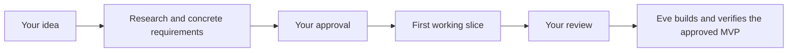

# ViperNxt

### Turn an idea into clear requirements. Turn approved requirements into a working MVP.

ViperNxt gives solo builders and small teams a repeatable path from “I want to build this” to a product they can try. It combines a requirements playbook, an opinionated SaaS stack and Eve, a hosted orchestrator that coordinates Cursor Cloud agents.

Use it for a SaaS idea, an internal tool or a personal workflow. Bring your idea, examples and decisions; the repository supplies the structure. You can work locally on requirements before connecting cloud services.


```mermaid
flowchart LR
  A[Your idea] --> B[Research and concrete requirements]
  B --> C[Your approval]
  C --> D[First working slice]
  D --> E[Your review]
  E --> F[Eve builds and verifies the approved MVP]
```

## 1 · Get the requirements right

Start with `/next`. The playbook researches existing solutions, gathers workflow evidence and helps settle the decisions that implementation needs:

- Users, roles, tenant boundaries and permissions.
- Entities, relationships, ownership, lifecycle and business rules.
- Screens, form fields, validation, table columns, search/filter/sort and empty/error states.
- Integrations, failure recovery, operational constraints and observable acceptance cases.

The result is a versioned design, domain model, journey spine and requirements packet. Material unknowns stay visible. You approve concrete scope; the playbook remembers settled decisions across sessions.

## 2 · Build the MVP

The selected stack is scaffolded, then one useful journey is built for you to review. After you accept it and authorize the remaining scope, Eve implements slices, runs independent reviews, checks the integrated result and follows the approved staging-delivery policy.

Eve handles bounded recoverable failures. Jev helps classify problems that require an owner decision; Slack can notify you with the failure, attempted recovery, evidence and next action. Scope changes and unresolved business choices return to you. Production release is a separate owner action.

## Before you start

| Requirement | When / purpose |
|---|---|
| [Bun](https://bun.sh) 1.4.0, Node.js 24, Git | Install and run the starter/Eve tooling |
| Agent editor with repository skills | Discovery and /next; Cursor and Claude Code aliases are included |
| Your own GitHub repository | Product work; do not push an idea into the upstream starter |
| `CURSOR_API_KEY` | Hosted implementation via Cursor Cloud Agents |
| `AI_GATEWAY_API_KEY` | Eve and Jev model access through Vercel AI Gateway |
| `VERCEL_TOKEN` | Link/configure/deploy the factory; this is **not** an AI Gateway key |
| GitHub connection through Vercel Connect | Eve reads issues, starts approved work and delivers PRs |
| Slack bot token + signing secret + owner/channel IDs | Optional interactive owner alerts |

There is no separate required `EVE_TOKEN` in this integration. “Eve access” means an AI Gateway key and the factory's authenticated provider connections. Product services such as Clerk or Neon need their own credentials only when your approved recipe uses them.

See [the setup guide](docs/START.md) for credential links, exact permissions and deployment steps.

## Start your own project

Fork this repository or create a dedicated copy, then clone **your** repository:

```sh
git clone https://github.com/<you>/<your-product>.git
cd <your-product>
bun install --frozen-lockfile
bun run setup
bun run doctor --stage=shape
```

Open the clone in your agent editor:

```text
/next I want to build [idea] for [people]. Today they solve it with [workflow].
```

Use `/next` to continue and `/status` to inspect progress. Personal/internal projects can use your own documented workflow; customer validation still requires real customer evidence.

For hosted implementation, fill the ignored `.env.factory.local` from [the example](.env.factory.example), then follow [START](docs/START.md). Tokens are never printed by doctor or copied into product code.

## An opinionated stack, selected to fit your idea

| Layer | Default |
|---|---|
| Application | Next.js App Router, React, TypeScript |
| Workspace | Bun + Turborepo |
| UI | Tailwind + shadcn/ui in a shared package |
| Auth | Clerk |
| Data | Drizzle + Neon; PGlite locally |
| Background work | Vercel Workflows |
| Optional analytics / email / files | PostHog / Resend / Vercel Blob |
| Verification | Biome, Bun tests, Playwright |
| Factory | Eve on Vercel + Cursor Cloud |

The [recipe](docs/kit/recipe.yaml) creates only selected surfaces. Auth, jobs, analytics, email and files can be excluded; headless products need no web app. The bare starter deliberately contains no sample customer application.

## Develop and verify

```sh
bun run dev                 # after scaffolding
bun run check-types
bun run check-boundaries
bun run check-tokens
bun run check-journeys
bun run check-skills
bun test
```

Branch from `staging` and open PRs into `staging`; `main` is production. Generated database scaffolds include migration CI.

The factory is experimental: controlled hosted trials have demonstrated bounded staging delivery and recovery. A new installation still needs its own model, GitHub, Cursor Build, deployment and optional Slack checks. Tests do not promise flawless delivery for every product.

[Setup](docs/START.md) · [Repository map](docs/map.md) · [Workflow](docs/playbook/fde-loop.md) · [Eve](deploy/eve/README.md) · [MVP coverage](deploy/eve/COVERAGE.md) · [Agent rules](AGENTS.md)

MIT for ViperNxt-owned material; [third-party notices](NOTICE.md) preserve bundled licenses.
